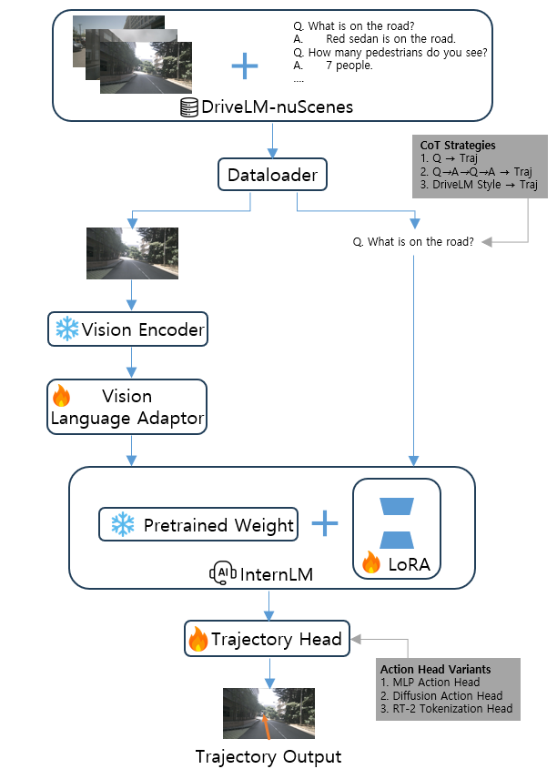

# VLM-Based End-to-End Autonomous Driving: Comparative Analysis of Reasoning Strategies and Action Heads

> This project is an ongoing research project.

## Project Overview

This project compares and analyzes end-to-end autonomous driving performance by combining various reasoning strategies and action heads for vision-language models (VLMs), based on the Intern v2 model and the DriveLM-nuScenes dataset.

## Overview Image

## Experimental Setup

- Base VLM: Qwen3-VL 2B
- Fine-tuning setup: LoRA on the LLM, with an optional vision adapter
- Image input: front camera

## Data Configuration

- Q&A dataset: DriveLM-nuScenes v1.1
- Training split: `challenge/data/v1_1_train_nus.json`
- Evaluation split: `challenge/data/v1_1_val_nus_q_only.json`
- E2E dataset: nuScenes in UniAD-style format
- Prediction target: ego trajectory prediction
- Trajectory format: 12 future points at 0.5-second intervals over a 6-second horizon
- Other agents' motion prediction is currently out of scope
- Core requirement: align the DriveLM Q&A data with UniAD-style E2E trajectory labels

## DriveLM-nuScenes Dataset
- Train: 4,072
- Val: 799

## Planned Comparison Axes

### Action Heads

- MLP head
- RT-2-style tokenization head
- Diffusion head

### Reasoning Variants

- No CoT: provide the front camera image and directly predict the trajectory
- Minimum CoT: generate perception output first, then use it as context for trajectory prediction
- DriveLM-style CoT: Perception -> Prediction -> Planning -> Behavior -> Motion

## Evaluation Metrics

- L2
- ADE
- FDE
- `obj_col`
- `obj_box_col`

## My Contributions

- Fine-tuning using only Vision Language Adapters and LoRA instead of full fine-tuning
- Prompt engineering with three Chain-of-Thought strategies
- Action head design and comparison: MLP, Diffusion, and RT-2-style tokenization
- Data loader design for VLM-based end-to-end autonomous driving
- Quantitative and qualitative evaluation, including L2 error, collision rate, and failure case analysis

## Results

- Preparation of a paper-style report for beginners in VLM-based end-to-end autonomous driving
- Quantitative comparative analysis of the contributions of VLM reasoning strategies and action heads
- Release of an open-source codebase for future research

## To Do

### Build Dataset

- [x] Create a concrete plan for this project: `README.md (this file!)`
- [ ] Align DriveLM v1.1 and UniAD trajectory labels: `python tools/match_drivelm_uniad.py`
- [ ] Build a dataset class (loader) that unifies DriveLM and UniAD-style data
- [ ] Verify one aligned sample by visualizing the ground-truth trajectory on the front camera image (front image, Q&A entry, GT)

### Build Baseline Model (No CoT + MLP Head)

- [ ] Build the baseline model: VLM model with LoRA on the LLM (optional: vision adapter)
- [ ] Attach an MLP head (LLM features -> MLP head -> trajectory output)
- [ ] Run a forward pass and verify output shape, loss computation, and metric pipeline with visualization
- [ ] Train and evaluate on a small subset first (L2 loss only; evaluate with L2, ADE, FDE, `obj_col`, and `obj_box_col`)
- [ ] Train and evaluate on the full dataset

### Create and Train CoT Pipeline Using Baseline Method

- [ ] Implement the minimum CoT pipeline
- [ ] Train and evaluate on a small subset (L2 loss only)
- [ ] Train and evaluate on the full dataset
- [ ] Implement a DriveLM-style CoT pipeline
- [ ] Train and evaluate on a small subset, first with trajectory-only loss (optional: DriveLM-style language loss)
- [ ] Train and evaluate on the full dataset

### Analyze MLP Head Method

- [ ] Compare three variants: no CoT, minimum CoT, and DriveLM-style CoT

### Implement RT-2 Head

- [ ] Implement the RT-2 tokenization head
- [ ] Train and test with three CoT variants on a subset
- [ ] Train and test with three CoT variants on the full dataset

### Analyze Token Head Method

- [ ] Compare three variants: no CoT, minimum CoT, and DriveLM-style CoT

### Implement Diffusion Head

- [ ] Implement the diffusion head
- [ ] Train and test with three CoT variants on a subset
- [ ] Train and test with three CoT variants on the full dataset

### Analyze Diffusion Head Method

- [ ] Compare three variants: no CoT, minimum CoT, and DriveLM-style CoT

## Acknowledgments

Special thanks to the following projects:

- [UniAD](https://github.com/opendrivelab/uniad)
- [Qwen3-VL](https://github.com/QwenLM/Qwen3-VL)
- [DriveLM](https://github.com/OpenDriveLab/DriveLM)
